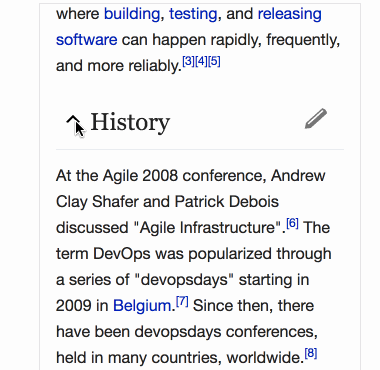

# Planning

Project requirements can be seen at [docs/ryfter-project.pdf](ryfter-project.pdf).

## References / Alternatives

* [Google Forms](https://www.google.com/forms/about/)
  * Very good reference, functionality-wise is very close to what we need to achieve.
* [Formbakery](http://formbakery.com)
  * Example UX alternative to Google Forms, featuring a sidebar with the necessary tools to build the Form and drag-and-drop.
* [Typeform](https://www.typeform.com/)
  * Similary to Frombakery, but for more complex use cases.
* [Formcrafts](https://formcrafts.com)
  * More clean alternative to Typeform/Formbakery
  * Pro: Allows to preview the final result when building.
  * Con: It's prepared for smaller forms, and with a lot more customization than needed for our case.
* [Conversational Form](https://space10-community.github.io/conversational-form)
  * It's a little off from our use case, because it solves the form usage not the creation, but a very interesting reference to keep in mind.

## Technologies

* [React](https://facebook.github.io/react/)
* [Redux](http://redux.js.org/)
  * For Managing the state of the app
* [Next.js](https://github.com/zeit/next.js)
  * Selected because it solves:
    * Assets bundling
    * Routing
    * Static build for the first release, which is not going to need backend

## MVP

The objective of the MVP is to have an interface which will allow the **user** _(looking for a hire for a company)_ to create a custom self-assesment form to send to possible **candidates** _(the person who's looking for a job)_.

### Design Constraints

* The form should look as close to the final result shown to the candidate as possible. This way the user will put itself on the candidate's shoes.
* The design has to follow https://ryfter.com styles.

**Palette:**

* Main: #575B6B
  * High Contrast: #F1F2F4
* Content/text: #36373E
  * High Contrast: #FFF
  * Low Contrast: #A4A5AD
* Text Links: #337ab7
* Success: #3C956C
  * Contrast: #E6F8F2
* Danger: #D51F2C
  * Contrast: #FAE9EA

**Font Family:** Gotham Ssm

### Features

Being the [requirements](ryfter-project.pdf) already defined, these are the features necessary for the first release:

The user will land on the form creation page, and:

- [ ] The form should contain a title stating the company's name and the job title
- [ ] The user should be able to add a Form Item, which could be a **Section Title** or a **Question**
- [ ] A Form Item should be deletable
- [ ] A Form Item should be draggable to change it's order
- [ ] A Question could be of any type and have the options defined at the [requirements](ryfter-project.pdf)
- [ ] The form should be submittable, but must have at least 1 Question
  * The submit event should POST the form data to https://requestb.in
- [ ] On SubmitSuccess, the user should be directed to a success page


The Redux state, at this point, should look something like:

```
{
  user: {
    fullName: 'Marc Hanson',
    profileUrl: 'https://ryfter.com/users/marc-hanson',
    avatar: 'https://randomuser.me/api/portraits/lego/1.jpg'
  },
  company: {
    name: 'Citrusbyte',
    profileUrl: 'https://ryfter.com/companies/citrusbyte',
    logo: 'https://pbs.twimg.com/profile_images/635822317717848064/61xnGgaY.png'
  },
  job: {
    title: 'Senior Frontend Engineer',
    url: 'https://ryfter.com/companies/citrusbyte/jobs/senior-front-end'
  },
  items: [
    {
      kind: 'section',
      title: 'Section Title'

      selected: true
    },
    {
      kind: 'question',
      title: 'This is a question?',
      description: 'Some example descriptions explaining the possible response.',
      required: true,
      response: 'short-text|long-text|ranking',
      rankingMinLabel: 'none',
      rankingMaxLabel: 'excellent',

      selected: false
    },
    ...
  ]
}
```

* _The fields `user`, `company` and `job` are going to be hardcoded, this values should be bootstrapped from backend on an eventual implementation._

* _An item with `selected: true` is showing all the necessary options to be edited_

### Deliverables

* GitHub repository containing the code and instructions on how to run it on a machine
* The project running on a public accessible url, deployed using [now.sh](https://now.sh)

### Estimation

The completion of the MVP is estimated to take **12hrs** of development, and is going to be delivered on **Thursday 30th May**.

## Next steps

### Sections Implementation

A functionality that did not enter the MVP to avoid complexity, was the ability to fold and re-position sections. Which Google Forms has and is really useful.

But, the solution implemented by Google Forms is too restrictive and is not draggable. Because the moment you add a section it is statically positioned and questions are strictly added to an specific section.

As an alternative implementation I propose to define a Section dynamically. So, the Section would be composed by the questions following it, until, and not including, the next Section title.

For example, Wikipedia sections:



The implementation should follow these rules:
* A section could be foldable
* When a section is folded, and dragged, it takes with it all the contained questions.
* When a section is folded, and deleted, it should delete all the contained questions.
* When a section is NOT folded, and dragged, it wont be dragged with the contained questions.
* When a section is NOT folded, and deleted, it wont delete the contained questions.
